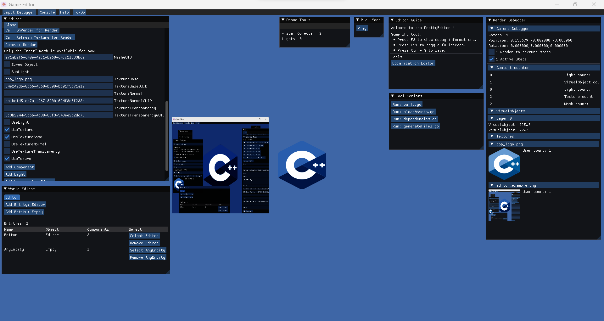

# Pretty-Engine

2D game engine written in C++.

This is a learning project, but I hope to make it a real engine that can use.
For now it's there to get feedbacks about it, there many bugs and issues in it.
Don't mind to use it until all features are set at something else than WIP.

I share it to get feedbacks and maybe give some help to people learning one of the library I use.

## Documentation

## Goals

- [ ] Easy to learn.
- [ ] Robust.
- [ ] Extendable.
- [X] OpenSource forever.
- [X] C++ Scripting.
- [ ] C Scripting.
- [ ] Go or Lua or JavaScript support.

## Known Issues

- Do not compile on Linux.
- CI Actions fails.
- Dependencies not well managed.
- No unit tests.
- Hard to debug (currently the work in progress point).
- Basic rendering engine.
- Basic physics engine.

## Getting started

### Build

You can use the go script in "tools", this one should execute everything correclty for you.
You can open it to know what the environement recommanded.

### File organization

- "./assets/" All assets are in the asset folder, the ENGINE_PUBLIC dir is for assets that will not be protected or
  compressed (used as tempory asset management).
- "./code/code" Used to allow adding scripts that are not considered as component or engine code.
- "./debug/" Contain a simple app that have for goal to be a playground for features at their early stage.
- "./entities/" Contain all the custom entities.
- "./external/" Contain all the dependencies.
- "./game/" Base source code for the game build (Not working for now).
- "./include/" Contain all the includes dedicated for the core of the engine.
- "./RenderFeatures/" A way to improve the rendering engine without having to add more code inside the Renderer object.
- "./shaders/" All the shaders of the project, the shaders are put in the header "shaders.hpp" by a go script.
- "./source/" Source files (.c, .cpp).
- "./tools/" Utility scripts in go.
- "./editor/" Same as the game directory but for the editor.
- "./components/" Where are contained all the components.

### Programming

The whole code is in C++ and it should continue, it's accepted to have C code sources.
Code conventions:

- All names are in CamelCase.
- Using an _ as prefix for private members.
- Use this everytime you access a member of the current class (optionnal for variable with the _ prefix).

### Architecture

Everything is contained in the Engine object, and the levels are a World (will be used later as a kind of prefab).
The end programmer can custom create entities and components, this is to provide a way to make strict way to how
features must be integrated.

The things called like RenderFeatures (the only one for now), is a way to extend the engine without having to edit the
core code source.

## Requirement

- GO Lang installation
- CMake
- LLVM (Clang)
- Ninja (Reference build system)

## Features

| Feature       | State |
|---------------|-------|
| 2D            | WIP   |
| 3D            | WIP   |
| 3D/2D Physics | WIP   |
| Audio         | WIP   |
| Editor        | WIP   |

## Platform support

| Platform | State                |
|----------|----------------------|
| Windows  | Supported by default |
| Linux    | WIP                  |
| Macos    | Not started          |
| Android  | Not started          |
| IOS      | Not started          |
